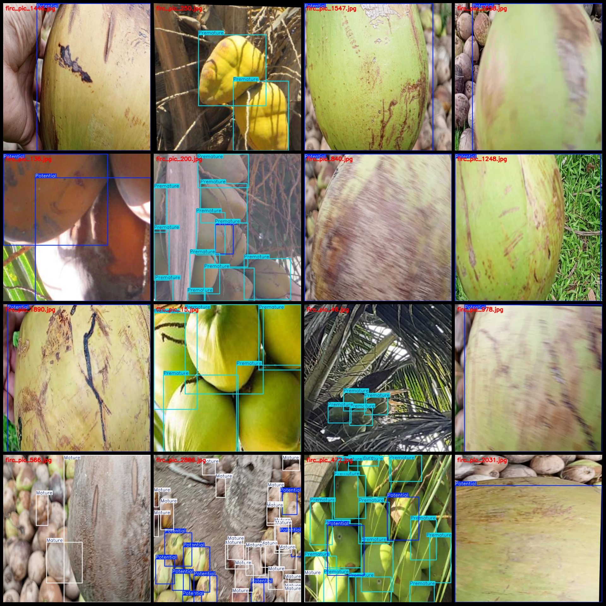
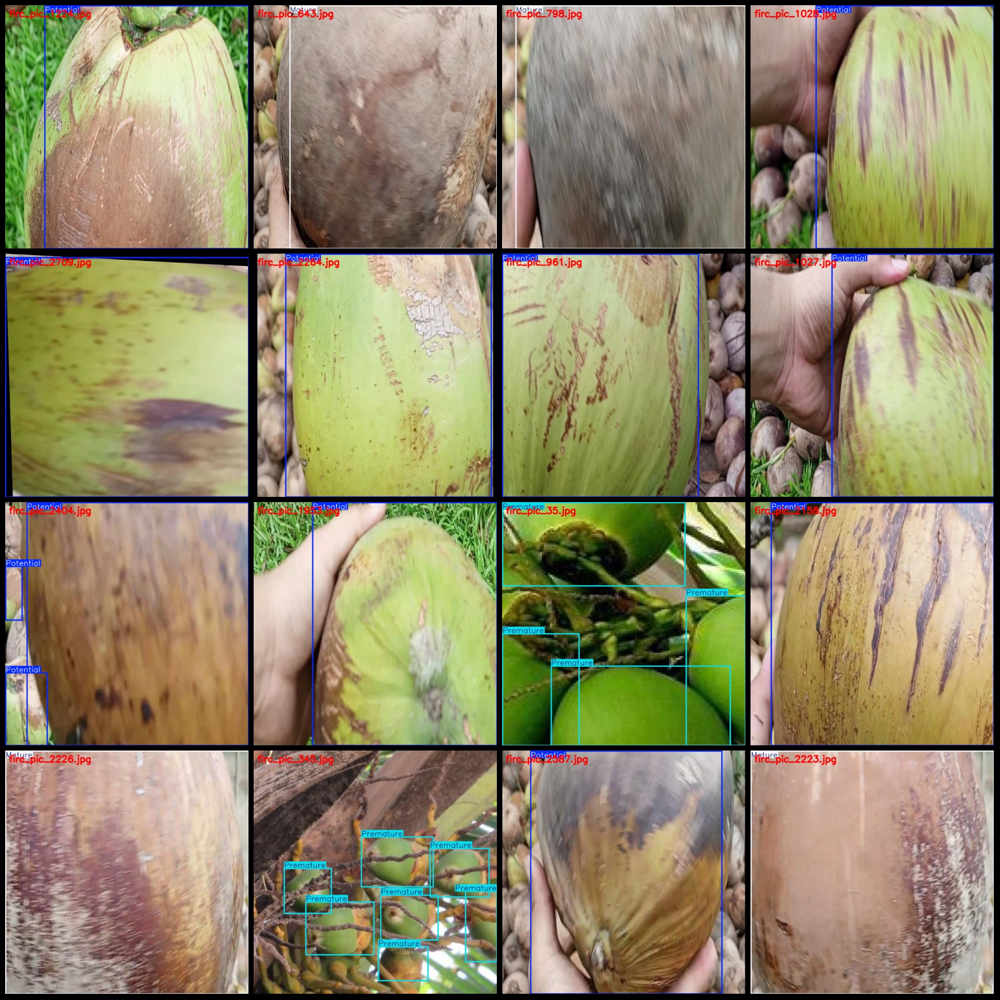

# Coconut Maturity Detection Dataset: VOC+YOLO format with 2887 images in 3 classes

Dataset format: Pascal VOC format + YOLO format (without split paths in txt files, only containing jpg images and corresponding VOC format xml files and YOLO format txt files)
Number of images (jpg file count): 2887
Number of annotations (xml file count): 2887
Number of annotations (txt file count): 2887
Number of annotation categories: 3
Annotation category names (note that the order of labels in the YOLO format does not correspond to this, but is based on "classes.txt" in the labels folder): ["Mature", "Potential", "Premature"]
Number of bounding boxes per category:
Mature = 1737
Potential = 3116
Premature = 3846
Total bounding boxes = 8699
Number of images per category:
Mature = 477
Potential = 1951
Premature = 689
Image resolution: 640x640
Annotation tool used: labelImg
Annotation rules: draw rectangle bounding boxes for each category
Important notice: The dataset does not have a split into training, validation, or test sets; it requires manual division.
Special declaration: This dataset does not guarantee any accuracy for models trained on it or the weight files.
Image preview:
Annotation examples:
## Images

Here is a pay link on Stripe ( https://buy.stripe.com/3cs8yP7sY87d0vu9AB ). Please contact me lonlonago@foxmail.com after funding $89, and I will send you a complete data files , thank you!

